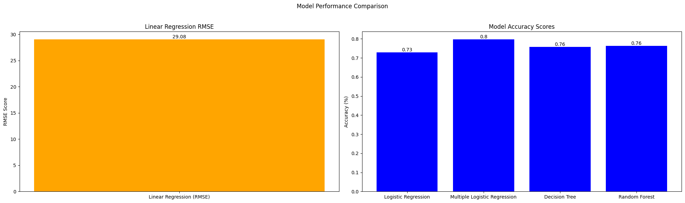
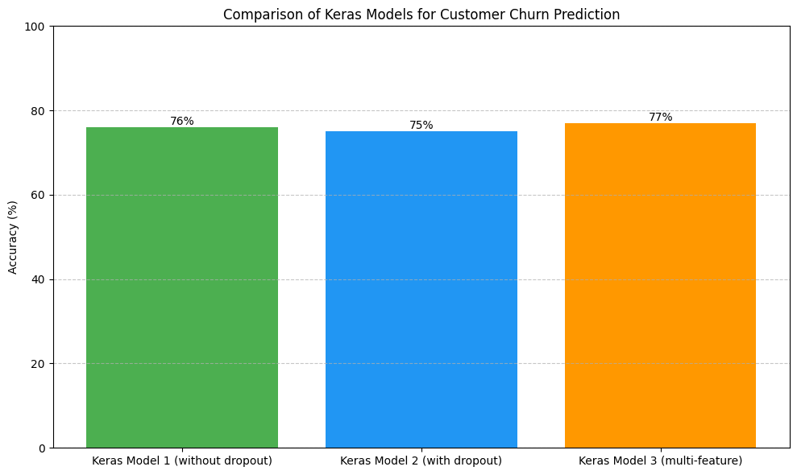

# AI-Driven Customer Churn Prediction

## Project Overview
This project aims to predict customer churn for a telecom company by analyzing customer data and identifying key factors that contribute to attrition. We employ a mix of machine learning algorithms (Linear Regression, Logistic Regression, Decision Tree, and Random Forest) as well as deep learning models using Keras to develop predictive models that highlight customers most likely to churn. This insight enables the company to focus on targeted strategies to retain customers, thereby preventing revenue loss and strengthening customer relationships.


## Dataset
- **Dataset Name**: `customer_churn.csv`
- **Rows and Columns**: The dataset consists of **7,043 rows** and **21 columns**.
- **Column Names**:
   - `customerID`, `gender`, `SeniorCitizen`, `Partner`, `Dependents`, `tenure`, `PhoneService`, `MultipleLines`, `InternetService`, `OnlineSecurity`, `OnlineBackup`, `DeviceProtection`, `TechSupport`, `StreamingTV`, `StreamingMovies`, `Contract`, `PaperlessBilling`, `PaymentMethod`, `MonthlyCharges`, `TotalCharges`, `Churn`

## Installation
To run this project, clone this repository and install the necessary dependencies:

```bash
git clone https://github.com/AnishMathewOommen/AI-Driven-Customer-Churn.git
cd AI-Driven-Customer-Churn
pip install -r requirements.txt
```

## Project Structure

### A) Data Manipulation
1. **Extract specific columns**:
   - 5th column as `customer_5`
   - 15th column as `customer_15`
2. **Filter customer records**:
   - Male senior citizens with Electronic Check as Payment Method (`senior_male_electronic`)
   - Customers with tenure > 70 months or Monthly Charges > $100 (`customer_total_tenure`)
   - Customers with a two-year contract, Mailed check Payment Method, and churned (`two_mail_yes`)
3. **Random sampling**:
   - Extract 333 random records (`customer_333`)
4. **Count distinct values in `Churn` column**

### B) Data Visualization
1. **Bar Plot**:
   - For `InternetService` column with labeled axes and title.
2. **Histogram**:
   - For `tenure` column with 30 bins and labeled axes and title.
3. **Scatter Plot**:
   - Between `MonthlyCharges` (y-axis) and `tenure` (x-axis).
4. **Box Plot**:
   - Comparing `tenure` and `Contract`.

### C) Linear Regression Model
1. Build a model to predict `MonthlyCharges` based on `tenure`.
2. Split the data into training (70%) and testing (30%) sets.
3. Calculate prediction error and Root Mean Square Error (RMSE).

### D) Logistic Regression Models
1. **Simple Logistic Regression**:
   - Predict `Churn` based on `MonthlyCharges`.
   - Train-test split (65:35) and calculate accuracy.
2. **Multiple Logistic Regression**:
   - Predict `Churn` using `tenure` and `MonthlyCharges`.
   - Train-test split (80:20) and calculate accuracy.

### E) Decision Tree Model
- Predict `Churn` based on `tenure`.
- Train-test split (80:20) and calculate accuracy.

### F) Random Forest Model
- Predict `Churn` based on `tenure` and `MonthlyCharges`.
- Train-test split (70:30) and calculate accuracy.

---

## Deep Learning Binary Classification Using Keras

1. **Data Manipulation**:
   - Count male customers.
   - Count customers with `DSL` Internet Service.
   - Filter records based on specific conditions.

2. **Data Visualization**:
   - Pie chart for churn distribution.
   - Bar plot for Internet Service distribution.

3. **Model Building Using Keras**:
   - **Model 1**: Single feature (`tenure`) to predict `Churn`.
   - **Model 2**: Single feature with dropout layers.
   - **Model 3**: Multiple features (`tenure`, `MonthlyCharges`, `TotalCharges`) to predict `Churn`.

### Model Configuration
- Input layer: 12 nodes with ReLU activation
- Hidden layer: 8 nodes with ReLU activation
- Optimizer: Adam
- loss: binary_crossentropy
- Number of epochs: 150–250

---

## Results

| Model                           | Accuracy |
|---------------------------------|----------|
| Linear Regression (RMSE)        | 29.08%   |
| Logistic Regression             | 73%      |
| Multiple Logistic Regression    | 80%      |
| Decision Tree                   | 76%      |
| Random Forest                   | 76%      |
| Keras Model 1 (without dropout) | 76%      |
| Keras Model 2 (with dropout)    | 75%      |
| Keras Model 3 (multi-feature)   | 77%      |



## Conclusion

The AI-Driven Customer Churn Prediction project provides valuable insights into identifying and understanding factors contributing to customer attrition. By leveraging a range of machine learning and deep learning models, this project highlights the predictive power of key variables like tenure, Monthly Charges, and Internet Service type. 

Our findings suggest that:
- **Multiple Logistic Regression** and **Random Forest** models achieve high accuracy in predicting churn, making them effective options for this dataset.
- **Deep Learning models** (especially those incorporating multiple features) also perform competitively, suggesting potential for complex pattern recognition in customer behavior.

With this model, the telecom company can implement targeted strategies to engage at-risk customers, reducing churn rates and enhancing customer retention efforts. This data-driven approach can support proactive decision-making and long-term revenue growth by focusing on the factors most closely associated with churn.